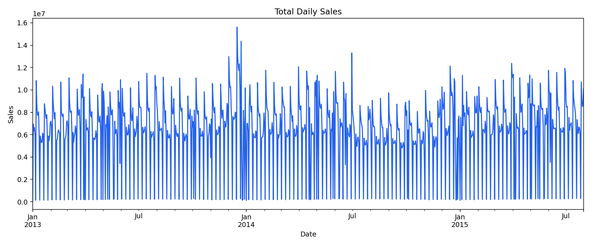
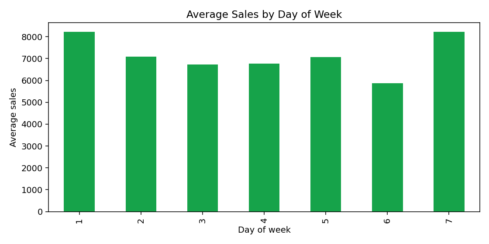
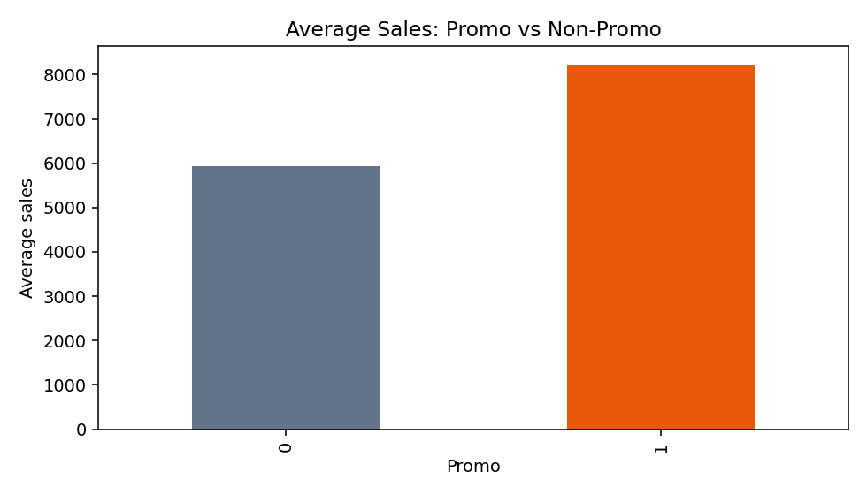
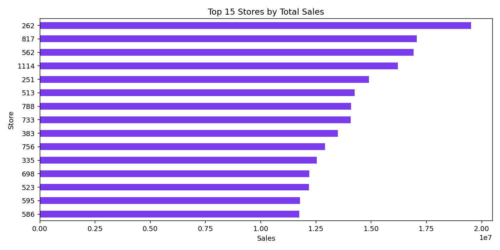

# EDA Report

Generated from `real Rossmann data`.

## Dataset Summary

| Item | Value |
|---|---:|
| Raw rows | 1,017,209 |
| Clean open-store rows | 844,392 |
| Stores | 1,115 |
| Date min | 2013-01-01 |
| Date max | 2015-07-31 |
| Total sales | 5,873,180,623 |
| Average daily sales per row | 6,955.51 |

## Promotion Effect

Average non-promo sales: 5,929.41

Average promo sales: 8,228.28

Estimated promo lift: 38.77%

## Generated Plots

### Total Daily Sales

### Average Sales by Day of Week

### Promotion Lift

### Top Stores

## What To Look For

- Demand has strong calendar behavior.
- Promotion days usually change average sales.
- Store-level volume varies significantly, so store-specific features matter.
- Total sales over time can reveal holidays, closure periods, and seasonality.
